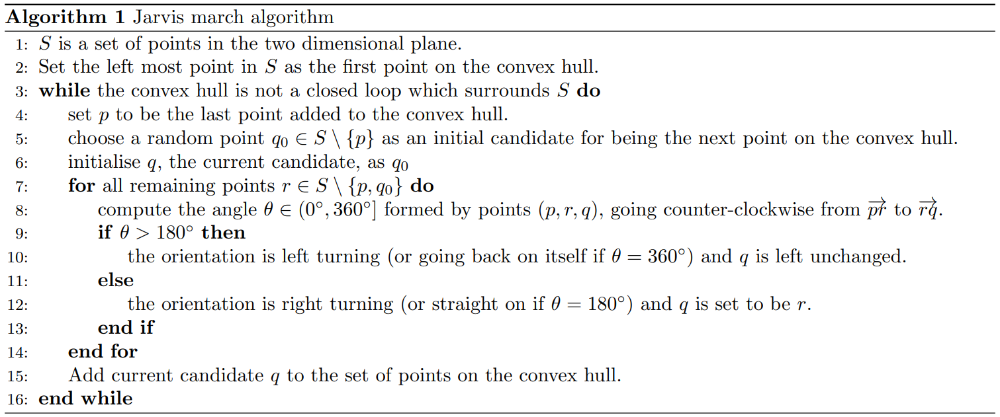

# convexhull

Package which contains a C++ implementation of the Jarvis March algorithm for finding the convex hull of a set of points on a two-dimensional plane. Supplementary notebooks and functions are also included.

**Installation**: install from R using the following command.   

install_github("grahamburgess3/convexhull")

In order for this command to work, you also need to load the devtools package (and install it too if necessary). Furthermore, for the package to work properly, you also need to load the ggplot2 and rlang packages (and install them too if necessary). For a complete example of ensuring all dependencies are loaded, see the first code cell of the "...RPackage_Examples..." notebook in the notebooks subfolder of this repository. 

**Usage**: Once the package is loaded (along with dependencies), you can use three functions within the package. 

* Use the **jarvis_march()** function to find the convex hull of a set of points. The input data must be in one of three formats. 1) A vector of $(x_0, y_0, x_1, y_1, ... )$ data containing $x$ and $y$ coordinates of the set of points. 2) a list with one element for each point, the ith element containing $(x_i, y_i)$. 3) a data.frame object with two columns, the first containing $x$ coordinate information of all the points, the second containing $y$ coordinate information. There is some error checking to check that (for example) you gave exactly two coordinates for each point. However, there is no error checking to check the data is numeric data. The jarvis_march() function will return an output which is a list with two elements. The first element is "input_data" which is the original point data in list format. The second element is "hull" which is a list containing one element for each line segement on the convex hull. The line segment starting at the ith point contains $(x_i,y_i,x_{i+1},y_{i+1})$

* The output of the jarvis_march() function is best visualised using the **plot_hull()** function. The argument of this function is the output list, a plot of the convex hull and any interior points will be returned. 

* Finally, you can use the **in_hull()** function to see whether a given point or set of points, is on the convex hull. The argument of this function must be a list of points, with each element being a vector of $x-$ and $y-$ information about the point. The output will be a list of the points which do lie on the convex hull. 

For a complete example of using this package, see the "...RPackage_Examples..." notebook in the notebooks subfolder of this repository. 

**Repository navigation** (four subfolders of interest: "src", "R", "notebooks", "data")

*convexhull/src*: this contains the jarvis_march-Rcpp.cpp file which contains the jarvis_march() function

*convexhull/R*: this contains supplementary R functions including plot_hull() and in_hull() - see "RPackage_Examples" notebook for more details

*convexhull/notebooks*: this contains the following notebooks: 

* *2023_GBurgess_Assignment_1_Python.ipynb*: this contains an alternative Python implementation of the code. 
* *2023_GBurgess_Assignment_1_CPlusPlus.ipynb*: this contains a notebook version of the C++ implementation of the code. 
* *2023_GBurgess_Assignment_RCpp_Task3.ipynb*: this contains an analysis of each implementation, including the pseudo code. 
* *2023_GBurgess_RPackage_Examples.ipynb*: this contains example usage of the convexhull package from an R kernel. 

*convexhull/data*: this contains example data which can be loaded to experiment with using the package. Examples of using this data can be found in the "2023_GBurgess_Assignment_1_Python.ipynb" notebook. 

**Pseudo code for Jarvis March**

